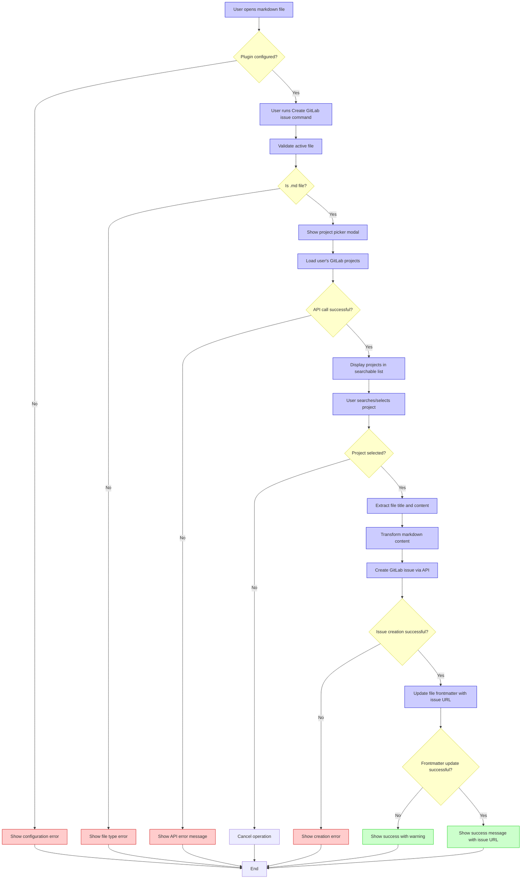

# Obsidian GitLab Issues Plugin

A plugin for Obsidian that creates GitLab issues directly from your markdown notes with project selection.

## Features

- **Project Selection**: Choose from your accessible GitLab projects during issue creation
- **Issue Creation**: Create GitLab issues using file name as title and content as description
- **Frontmatter Integration**: Automatically adds GitLab issue URLs to note frontmatter
- **Configurable Labels**: Set default labels to apply to all created issues
- **Multi-Instance Support**: Works with GitLab.com and self-hosted GitLab instances

## Installation

1. Clone this repository
2. Build the plugin:
   ```bash
   npm install
   npm run build
   ```
3. Copy `main.js`, `manifest.json`, and `styles.css` to your vault's plugins folder:
   ```
   YOUR_VAULT/.obsidian/plugins/obsidian-gitlab-issues-plugin/
   ```
4. Enable the plugin in Obsidian Settings → Community plugins

## Configuration

1. Open Obsidian Settings → Plugin Options → GitLab Issues Plugin
2. Configure:
   - **Personal Access Token**: GitLab token with `api` scope
   - **GitLab URL**: Your GitLab instance URL (defaults to gitlab.com)
   - **Default Labels**: Optional comma-separated labels for issues

## Usage

1. Open a markdown file in Obsidian
2. Run command: "Create GitLab issue from active file"
3. Select a project from the searchable list
4. Issue is created and URL added to frontmatter

## Configuration Workflow Flowchart


## Example

**Before:**
```markdown

# Bug Report

Description of the bug...
```

**After:**
```markdown
---
gitlab_issue_url: "https://gitlab.com/your-project/-/issues/123"
---
# Bug Report

Description of the bug...
```

## Development

```bash
# Setup
npm install

# Development build (watch mode)
npm run dev

# Production build
npm run build
```

## Contributing

Contributions welcome! Please test with multiple GitLab configurations before submitting.
